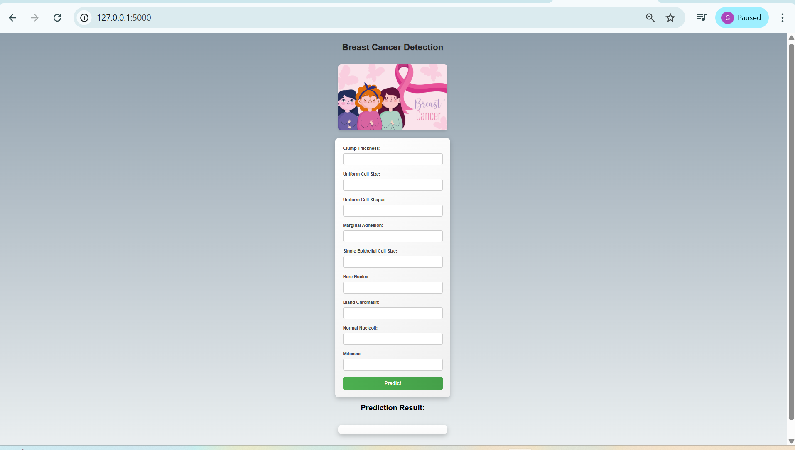
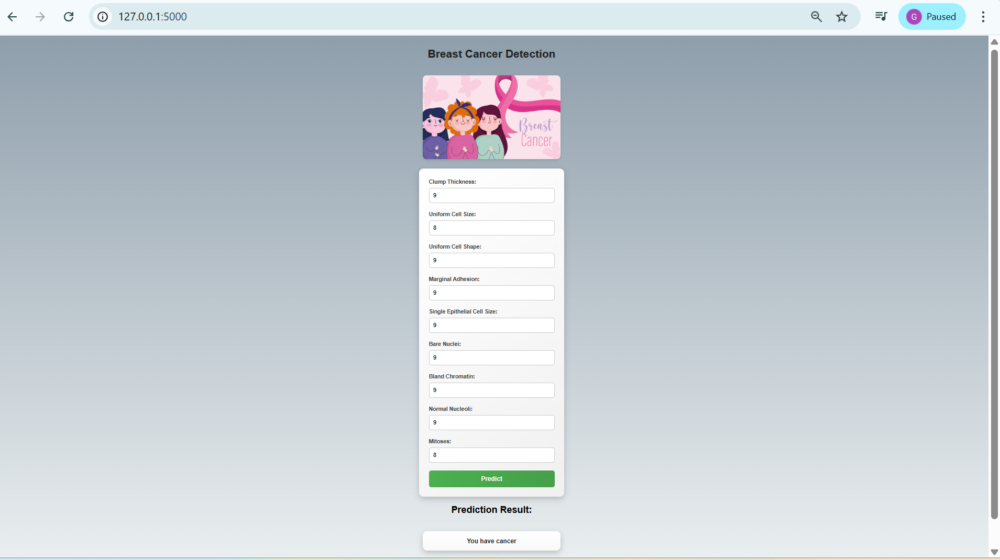
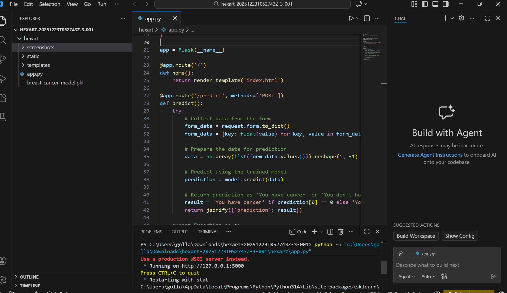

# Breast Cancer Detection Using Machine Learning

This project is a Flask-based web application that predicts whether a breast tumor is **benign or malignant** using a trained machine learning model. The system helps in early detection of breast cancer by analyzing medical features and providing accurate real-time predictions.

---

## 🚀 Features
- Predicts breast cancer as benign or malignant  
- Machine learning model integration  
- Flask-based web application  
- User-friendly input form  
- Fast and accurate results  

---

## 🛠 Technologies Used
- Python  
- Flask  
- Scikit-learn  
- Pandas  
- NumPy  
- HTML  
- CSS  

---

## 📦 Requirements

### Software
- Python 3.8 or above  
- Git  
- Web Browser  

### Python Libraries
- Flask  
- Scikit-learn  
- Pandas  
- NumPy  
- Joblib  

Install using:

```bash
pip install -r requirements.txt

📂 Project Structure

hexart/
│
├── app.py
├── breast_cancer_model.pkl
├── templates/
│   └── index.html
├── static/
├── screenshots/
│   ├── home.png
│   ├── result.png
│   └── terminal.png

## Installation

```bash
git clone https://github.com/GMahesh08/Breast-Cancer-Detection.git
cd Breast-Cancer-Detection/hexart
pip install -r requirements.txt
python app.py

Open in browser:
http://127.0.0.1:5000/

## Screenshots

### Home Page


### Result Page


### Terminal Output



🎯 Use Case

This system can assist doctors and medical researchers in predicting breast cancer early, helping in timely treatment and better healthcare decisions.

⭐ Support

If you like this project, please give it a star ⭐ on GitHub.
